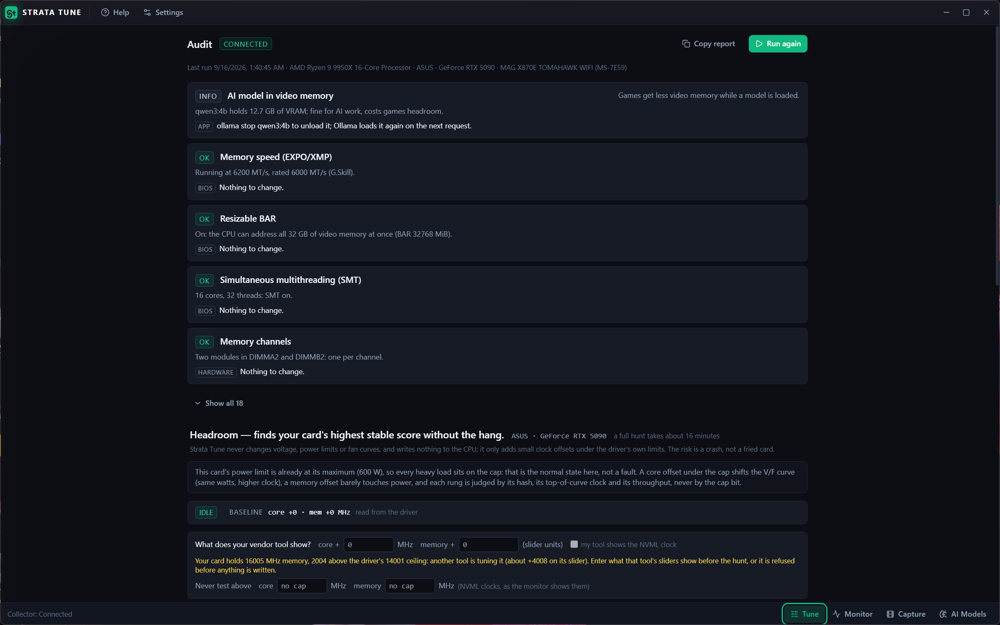
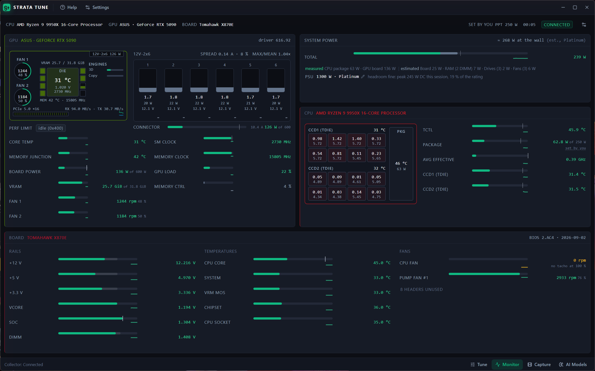
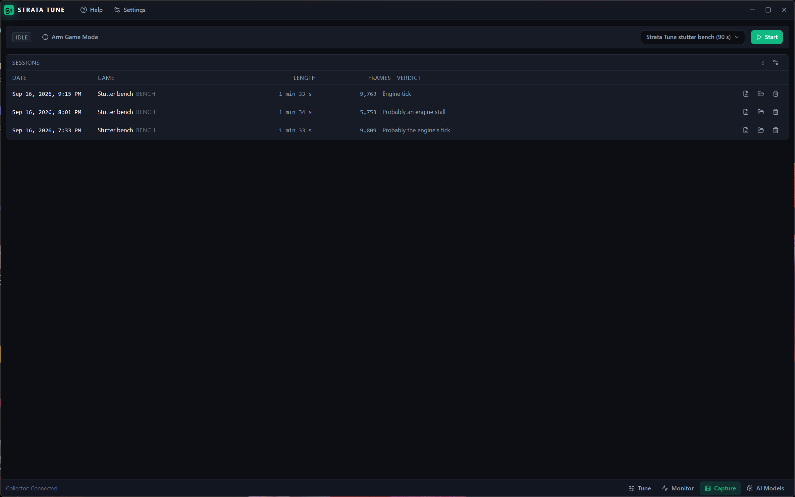
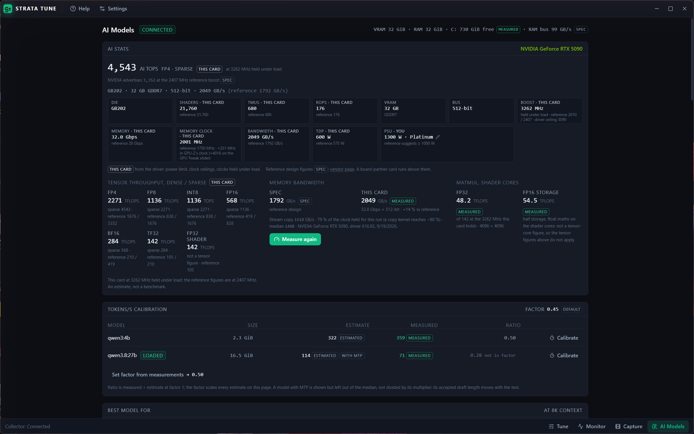

# Strata Tune

PC tuning and diagnostics for Windows: what is wrong with this PC, what it costs, and how
to fix it. Free, no accounts, no telemetry, no cloud calls. Everything runs on your machine.
Fifth member of the Strata family (Code, Photo, Video, Snap/Remote).

**[Download the latest release](https://github.com/jawanjalkaustubh/strata-tune/releases/latest)**
(portable zip, Windows 10/11 x64, no installer).

## What it does

| Page | What you get |
|---|---|
| **Tune** | An audit of this PC: a snapshot, a short idle sample, a light PCIe load and a 20 s thermal ramp, judged by rules for the CPU, the GPU, memory, timers and power, ranked by severity and what the fix costs. Beneath it, off by default, the **Headroom hunt**: it adds small clock steps on top of your current GPU tune, tests each for a minute with a workload whose result it can check, scores every step, and hands you the values to type into your vendor's tool. It never changes voltage, power limits or fans, and it leaves the card as it found it. |
| **Monitor** | An instrument panel: CPU, GPU and board panels in their vendor colours, the chip diagram, clocks and limits, the 12V-2x6 connector per pin where the card reports it, rails, fans, system power and the wall-side estimate for your PSU. |
| **Capture** | Frame times from any windowed game or benchmark, or from the built-in 90 s stutter bench that needs no game. The report names each stutter's likely cause (engine tick, shader compilation, engine stall, driver, paging and so on) and says whether the CPU or the GPU is the limit. Exports as one self-contained HTML file. |
| **AI Models** | Which local AI models fit this machine and how fast they will run: every quant of every model sized against VRAM and RAM, tokens/s estimated from measured bandwidth, one-click `ollama pull`, and real measurements through Ollama when it is installed. |

## Screenshots

| Tune | Monitor |
|---|---|
|  |  |

| Capture | AI Models |
|---|---|
|  |  |

## Install and run

1. Download `Strata-Tune-Windows-x64.zip` from the
   [latest release](https://github.com/jawanjalkaustubh/strata-tune/releases/latest) and unzip it
   anywhere. Nothing is installed into Windows and nothing runs at startup.
2. Install the **PawnIO** driver from <https://pawnio.eu> if you don't have it. It is the small,
   signed driver LibreHardwareMonitor uses to read CPU, board and memory sensors. Without it the
   sensor service cannot read your CPU.
3. Run **Strata Tune.exe**. The first launch shows the disclaimer and waits for *I understand*.
   Then Windows asks once (UAC) to start `strata-tune-collector.exe` elevated: that is the sensor
   service. It listens only on `127.0.0.1` with a per-launch secret, answers only this app, and
   exits when the app closes. Decline and the app still opens, with a *Retry* where the sensors
   would be.
4. Windows SmartScreen may show "Windows protected your PC" because this release is not
   code-signed: *More info* → *Run anyway*.

**Requirements.** Windows 10 or 11 x64. Any CPU (sensor rules exist for AMD Ryzen and Intel
Core). A GPU is optional; the GPU audit, the card panel, the AI Models measurements and the
Headroom hunt need an NVIDIA GeForce card with a current driver. Capture runs without elevation
when your account is in the *Performance Log Users* group. Install [Ollama](https://ollama.com)
to measure real tokens/s on the AI Models page.

**Where things go.** Sessions, logs and settings live in `%LOCALAPPDATA%\Strata Tune`; delete
the folder and the app is back to first launch.

## Overclocking, plainly

The Headroom hunt is behind a settings switch and a warning. It stops at the first small
mistake (a wrong result or a driver reset), long before the card would hang; you may see the
screen freeze for a second or two when the driver resets, and that is the signal it stops on.
A crash can still lose unsaved work in other apps, so save first. Any overclock you then apply
yourself is at your own risk and may affect your warranty. Read [DISCLAIMER.md](DISCLAIMER.md).

## Development

The design lives in [docs/master-plan.md](docs/master-plan.md); the original idea
document is [docs/spec-original.md](docs/spec-original.md). Electron 34 + React 18 + Vite +
TypeScript for the app, a .NET 10 collector for the sensors (elevated, loopback only), a DX12
worker and bench. `installer/package.ps1` builds the release zip; `scripts/build-collector.ps1`
publishes the native exes it needs.

## Development status

| Phase | State |
|---|---|
| 0 Shell and toolchain | Electron 34 + React 18 + Vite 6 + Tailwind scaffolded from Strata Video. Frameless window, GPU acceleration off by design (the app must never contend with a card under test), `St` monogram, title bar with Help/About, bottom-bar page switcher (Tune · Monitor · Capture · AI Models since 2026-09-16: Tune is the home page and holds the audit; the Headroom hunt beneath it sits behind a settings switch), `STRATA_SELFTEST=1` check that measures the GPU feature status with acceleration off. .NET collector solution in [`collector/`](collector/README.md) (SDK 10.0.401 pinned by `global.json`; Shared, Collector, Worker; builds Release with zero warnings): `strata-tune-collector --probe` reads this box elevated through LibreHardwareMonitor 0.9.6 + PawnIO 2.2.0, NVML and PDH, refuses to run non-elevated (exit 2) and exits 4 rather than reporting zeros when PawnIO's device will not open (the raw probe is gitignored because it is a dump of one machine; its numbers are quoted in [collector/README.md](collector/README.md)); PresentMon 2.5.1 vendored by `scripts/setup-tools.ps1` with size and SHA-256 pinned, 28-column CSV header confirmed on the QPC clock ([docs/phase0-presentmon-sample.csv](docs/phase0-presentmon-sample.csv)); `strata-tune-worker --hash` (ComputeSharp 3.2.0, uint-only kernel) returns the same hash `5ed206bd4475e275` in every process and on the Radeon iGPU, refuses WARP (exit 3, exercised with `--adapter`), and maps device loss to exit 10 (read from ComputeSharp's exception shapes, not yet exercised by a real TDR). **Sensor-layer go/no-go: GO.** PawnIO + LHM read Tctl 49 C, package power 63-68 W, the NCT6687D-R fans/temps/voltages and the DIMM SPD sensors with HVCI on; the HWiNFO fallback from plan section 22 is not needed. Carried into Phase 1: LHM identifiers are not unique on this box (`/gpu-nvidia/0/voltage/0` and `/gpu-nvidia/0/load/3` each appear twice), so the stream layer needs a disambiguation rule. |
| 1 Audit | **v0.1.** The elevated collector ([collector/README.md](collector/README.md): handshake, token, ring buffer, LibreHardwareMonitor 2 Hz + NVML 10 Hz + PDH 1 Hz, snapshot, SSE, load runs), the **Audit** page (the plan section 8 rules in `src/analysis/audit.ts`: snapshot, 5 s idle sample, 3 s light PCIe load, 20 s heavy thermal ramp judged over its steady window behind an engagement gate; top five by severity × cost, show all, copy report) and the **Monitor** page (plan section 17a: vendor-accented CPU, GPU and Board panels, the chip diagram with hover detail, the 12V-2x6 connector block with spread and max/mean, the system-power row, rails, fans, sparklines; pieces in `src/components/monitor/`). No-orphan rule enforced on both sides. **Polish (2026-09-16, the user's feedback on the live app, `.claude/workflows/phase1-polish.md`):** device names on the panel headers (the GPU's board partner from the PCI subsystem vendor id, `nvmlDeviceGetPciInfo_v3` + `src/data/vendors.json`), every title renameable in place; the CPU power limit as a setting (`cpuPptW`, the stock PPT from `cpus.json` labelled *stock* until set) with PBO inferred from the measured package power; movable, resizable panels persisted in settings, with Reset layout; the plan section 17a card schematic pulled forward into the GPU panel (fans as duty arcs, VRAM as chip fill, die, engines, PCIe edge with Rx/Tx, 12V-2x6 stub); five CPU audit rules over a 20 s all-core vector-FMA load (`strata-tune-worker --cpu-load`; it pulls this 9950X to 264 W and its 95 °C Tjmax, so the rules have something to judge); GPU overclock detection from `nvmlDeviceGetClockOffsets` and the reworded power-limit finding; the collector answers and streams from t+62 ms with the sensor groups opening behind `warming` (the app connected at t+217 ms against 9.7 s before; PDH's first enumeration at t+7.7 s is the last source in). Evidence in the same document. **Polish 2 (2026-09-16):** the missing-ROPs rule (`gpu-units`): the collector reads shader, SM, ROP and TMU counts through NVAPI (`Nvapi.cs`, ids verified against three open-source readers; `GpuFacts.units`) and the audit compares them with the card's `gpus.json` row — "176 of 176 ROPs, 21,760 shaders: the full GeForce RTX 5090 configuration." here; a driver that refuses the count gets a sixth audit step, the bench's 6 s fill-rate cross-check (`strata-tune-bench --fillrate`, `src/analysis/gpuUnits.ts`), judged against the ROP bands and never decisive on its own. The "AI model in video memory" row is omitted entirely when Ollama is not running. **Polish 3 (2026-09-16/17, `.claude/workflows/polish3.md`):** the audit is the top of the **Tune** page (the Audit page entry is gone; `navigate.ts` routes audit intents there); the CPU thermal rule reads Tctl pinned at Tjmax with clocks holding as INFO ("Nothing lost: the clocks held"; WARN only on a ≥ 5 % sag or Tctl within 2 °C of Tjmax at rest) and its advice knows the Curve Optimizer the user entered ("you already run −30 all-core Curve Optimizer, so the remaining levers are a lower PPT in the BIOS or better cooling"); the Monitor's gear popover groups *CPU tuning you set in BIOS* (PPT, TDC, EDC, CO all-core, CO per core, each tagged *set by you*; Intel parts show PL2); the 12V-2x6 block exists only with per-pin current sensors (a Founders Edition shape renders no block, no spread, no fallback line); the stats card gains the MEMORY CLOCK tile in the GPU-Z convention (this box 2005 MHz · reference 1750 · +255 with the tune through the driver's P0 route; `memoryClockMhz` on every `gpus.json` row from its TechPowerUp page) and never scales a peak by a clock seen below the reference boost (a stream copy holds the SM at 1192 MHz here); `nvmlDeviceGetClockOffsets` counts the memory offset on the effective rate (+4072 for the +2036 NVML MHz P0 delta), halved in one place (`thisCard.ts nvmlMemOffsetMhz`) before it meets an NVML clock; every long action has Stop (audit: `POST /load/{id}/cancel` kills the worker, the page shows *Interrupted at step N of M* with the checks that completed; Measure / Calibrate abort the worker or the Ollama request; Escape does the same); About is the plan §17 hub (Windows edition and build, DirectX from dxdiag, driver, collector / PawnIO / HWiNFO status, Save system report .txt / .html with serials redacted, Clocks, Timers with `NtQueryTimerResolution` and powercfg's holder trace, Validation, Copy hardware summary, Open logs folder; Legal tabs rendered from the bundled `LICENSE`, `DISCLAIMER.md`, `THIRD-PARTY-NOTICES.md`); the audit's `timer-resolution` rule names the holders once per program with a count. Verified in the real app on 2026-09-17 (audit run and stopped mid-load, Measure stopped, About and Timers traced, the Monitor's block on this Astral card and absent with a Founders-Edition mock tick). |
| 2 Sensors | Not started. |
| 3 AI advisor | **v0.2.** The **AI Models** page (plan section 10). `src/data/models.json` (22 models, 73 Ollama pull tags, every tag checked against ollama.com and the architecture numbers read from the GGUF metadata Ollama serves; a row whose GGUF carries an MTP head that Ollama runs as speculative decoding says so with `mtpAcceptedTokens`, which multiplies its tok/s and keeps it out of the calibration factor; a row with sliding-window blocks (Gemma 3, gpt-oss) says so with `swa`, so its KV cache is sized at the window as llama.cpp's iSWA cache does), `src/data/gpus.json` (37 NVIDIA, AMD and Intel rows: the vendor's advertised AI TOPS exactly as printed with its precision and sparsity, the spec tiles from each card's TechPowerUp page (die, shading units, TMUs, ROPs, memory type, bus, data rate, base/boost, TDP, the vendor's PSU recommendation), bandwidth for every row, tensor TOPS per precision dense and sparse with BF16/TF32 from the Blackwell whitepaper tables, FP32 shader TFLOPS; a figure nobody publishes is `null`, a dense figure halved from a sparse headline is flagged `denseDerived`) and NPU TOPS on the `cpus.json` rows. `src/analysis/advisor.ts` sizes every quant of every model (the pulled file + GQA KV cache at the chosen context, windowed blocks at their window + vision tower + reserves) against VRAM and RAM into Runs fast / Runs, tight (under 1.5 GiB of headroom) / Runs slowly (with the offload cliff) / Won't run, estimates tok/s from bandwidth (a measured copy rate, or spec x the 0.8 a stream copy reaches), sorts by total parameters so a 30B-A3B ranks as a 30B, checks the download against the model drive and picks the best model for chat, coding, vision and reasoning among the rows whose window holds the context. The **AI stats card** opens with the advertised figure ("3,352 AI TOPS · FP4 sparse"), the architecture line and the spec tiles, then dense/sparse pairs, spec against expected and measured bandwidth, and the worker's matmul beside the shader spec, every number tagged spec / measured / estimated / derived / default. Each model row carries a one-click `ollama pull <tag>`; without Ollama the page says once "Install Ollama to measure real tokens/s on your models." Measurements come from `strata-tune-worker --bench --json` (a 1 GiB stream copy and a 4096 fp32 / fp16-storage matmul, timing-only, cached per GPU and driver in `bench.json`, applied only to the same card) and from a timed 256-token Ollama generation per installed model, both through `electron/bench.ts`; "Set factor from measurements" makes the median ratio this box's own factor, warned when it leaves the 0.3–1.0 band. Without the collector the page runs standalone from a GPU picker, RAM and free-space inputs. Calibrated on the dev box in [docs/phase3-calibration.md](docs/phase3-calibration.md): the 5090 measures 1603–1611 GB/s (80 % of the bus its +229 MHz memory offset gives), and qwen3:4b decodes at 0.50 of the bandwidth bound, so the plan's 0.65 factor is now the measured 0.50 — from one dense 4B model only; the dense 30B-class and MoE pulls the plan's three-model calibration needs (20 + 19 GB) wait for the user, and MoE rows carry a "MoE ceiling" chip until one is timed. **Polish 2 (2026-09-16, the user: "the spec vs the actual value doesn't make sense, my 5090 has 600 W TDP and I have a 1300 W PSU"):** the spec tiles lead with **this card** and demote the table row to *reference* (`src/components/advisor/thisCard.ts`: the board's default power limit (`nvmlDeviceGetPowerManagementDefaultLimit`, the slider's top said beside it when higher), the shader / TMU / ROP counts NVAPI reads, the memory rate from the driver ceiling plus any offset in force or from the clock the card was seen holding under load — only a *loaded* reading ever counts (`loadedClocks`, utilisation ≥ 50 %), so an idle card on a driver without ceilings leaves the reference standing — with `useHeldClocks` polling `/gpu` while the page is open), the PSU tile is the user's own supply set once in the inline form, and the bandwidth block is the plan's three columns *spec · this card · measured*. **Polish 3 (2026-09-16):** the BOOST tile leads with the SM clock held under load (the driver's 3090 MHz VF-curve top is the last word of its sub-line, never the headline), the AI TOPS headline and the dense / sparse pairs are this card's — the reference peak × held clock / reference boost, "NVIDIA advertises 3,352 at the 2407 MHz reference boost" muted beneath — and `bench.json` remembers the clocks the sweep held (`heldSmMhz` / `heldMemMhz`, polled from the collector by `electron/bench.ts`), so a measurement is judged against the ceiling in force when it was taken and one muted line says when a run or the last load held less than the card's record (the memory offset not applied, the vendor tool closed); the tile row is `auto-fit` at 150 px at every width. On this box after Measure: 4,470 AI TOPS at 3210 MHz held under load, 32.0 Gbps / 2049 GB/s this card, TDP 600 W (reference 575), 176 of 176 ROPs, PSU 1300 W · Platinum (reference suggests ≥ 1000 W), measured 1608 GB/s = −22 % of the clock held for the run, −2 % vs the expected copy; NVAPI's P-state deltas read 0 / 0 while the card holds 16008 MHz, so GPU Tweak's offset is only ever seen as a held clock, never as an offset. **Deferred:** the plan's `diffusion` row type (LTX-2.5 / Gemma 4 12B from Strata Video) needs a sizing model of its own (no KV cache, steps/s not tok/s) and is not in `models.json`. |
| 4–5 Capture and stutter classifier | **Built; the bench runs end to end from the app on this box (2026-09-16); not yet judged on a game.** The **Capture** page (`src/pages/Capture.tsx`, `src/components/capture/`): pick a windowed process or arm Game Mode; PresentMon 2.5.1 runs *unelevated* from Electron main (`electron/presentmon.ts`, `electron/capture.ts`; this user is in Performance Log Users, so the host is not in the collector as the plan says); frames stream into `%LOCALAPPDATA%\Strata Tune\sessions\<stamp>-<exe>.stsession` (`frames.ndjson.gz`, `sensors.ndjson.gz` sliced from the collector's window while it is connected, `gpu.ndjson.gz` from its ticks, `session.json`; `electron/sessions.ts`). A multi-process app is captured by image name, because the presenting pid is its GPU helper, not its window. Analysis runs in the renderer (`src/analysis/frames.ts`, `stutter.ts`, `bound.ts`: detection, the nine section 11 cases with confidence, the section 12 CPU-or-GPU verdict; `src/components/capture/toReport.ts` maps it for the renderer), the report is `src/report/ReportView` in-app and as one self-contained HTML file (`sessions:exportHtml` in `electron/capture.ts` fills the template from `npm run build:report`, which `npm run build` runs as `postbuild`). Verified: a 20 s capture of `claude.exe` with the collector up saved 4,337 frames, 262 sensor rows and 40 GPU samples; the session reopened with a headline and the measurements table; the exported file opened standalone from `file://`. **Bench end-to-end (polish 2, 2026-09-16, the user: "just use whichever inbuilt we created, and the user should be able to pick any benchmarking tool like Geekbench or games"):** the picker (`src/components/capture/ProcessPicker.tsx`, `electron/picker.ts`) opens on three groups — *Built-in bench* (`Strata Tune stutter bench (90 s) · no game needed`, the default pick, remembered), *Benchmarks and games detected* (`src/data/benchmarks.json`: Geekbench, 3DMark, Cinebench and the rest, plus the Game Mode allowlist, Steam / Epic / Battle.net / Store library paths and their publishers) and *Show all · N other windows* behind a fold, with the shell, overlays and the Strata apps filtered out. Start with the bench picked runs `strata-tune-bench.exe` from Electron main (`electron/bench-run.ts`: preflight for a running worker or bench, the family's `gpu.lock` holder and a resident Ollama model, window sized to the display capped at 1080p, exit codes 3 / 10 / 11 in plain words), PresentMon follows its pid, the live line names the script segment, the session records `trigger: bench` with the `--json` summary and its segment timings, and the report opens on its own with the *Bench check* table (each designed segment against what the classifier called it). Two full runs on this box: 9,809 frames at 120 fps in the foreground (Hardware: Independent Flip; 1.2 % lost to 30 stutters, engine tick 54 % / shader compilation 46 %, 3 of 4 designed segments matched) and 5,753 frames with the window behind others (Composed: Flip at ~64 fps; 2.5 % lost to 32 stutters, engine stall 48 % / engine tick 29 % / shader compilation 23 %, 2 of 4 matched: DWM pacing shows up as engine stalls in the gpu-load segment, so a bench under composition is not comparable). Waits: a real game capture (the Phase 5 gate), a "composed, not comparable" note on the bench report, and the "fine" line for short captures (one hitch in 17 s is 3.5 a minute, over the 2-a-minute line, so a single 9 ms frame headlines its cause). |
| 6 Power | PSU model and the PSU setting: `src/analysis/psu.ts` + `src/data/psu.json` (80 PLUS curves, wall watts from DC watts, over/tight/good/generous verdict with a recommended size, the transient disclaimer text). **The PSU asked once (polish 2, 2026-09-16):** `psuWatts` / `psuRating` in `src/settings.ts`, set through the inline form (`src/components/advisor/PsuForm.tsx`) on the AI stats card's PSU tile and under the Monitor's SYSTEM POWER row; once set, the Monitor row shows the wall-side estimate ("≈ 206 W at the wall (est., Platinum)" over "measured CPU package 65 W · GPU board 75 W" and the estimated board, DIMMs, drives and fans) and the headroom verdict against the rating ("PSU 1300 W · Platinum · headroom fine: peak 182 W DC this session, 14 % of the rating") with the 10 Hz / transient disclaimer as its tooltip, and the card's tile reads "1300 W · Platinum" over the vendor's suggestion. This box: Lian Li Edge 1300 W Platinum, stored as `psuWatts: 1300, psuRating: 'platinum'`. Waits: cost and performance-per-watt, and the estimated parts of the plan section 13 table. |
| 7 Score and share card | Libraries only: `src/analysis/score.ts` (four subscores, weights renormalised over what was measured, the stability cap, validity flags that make the total null), `src/report/ShareCard.tsx` (1200x630 SVG drawn to a 2D canvas), `src/analysis/history.ts` + `electron/history.ts` (`history.json` in the app's userData, IPC `history:list` / `history:add`). Waits: a page that runs the fixed workload, computes and shows the score and the card, and the section 15 before/after view; nothing in the renderer calls `api.history` yet. |
| 8 Tune | **Headroom — finds the numbers, hands them over, leaves the card as found (plan §16 as of 2026-09-16); one real hunt through the live collector on 2026-09-17.** Help → Settings → *Headroom hunt* behind the §27a warning (the plain paragraph of what happens, the one risk line, the writes sentence naming `NvAPI_GPU_SetPstates20`, DISCLAIMER section 3 behind a *full text* fold; the acknowledgement goes to the tune log with date, app version and GPU). The Headroom section of the Tune page (`src/components/tune/Headroom.tsx`): the power-cap sentence for a card whose limit is at its maximum, the state strip (IDLE / PENDING / REVERTED with the baseline named as the driver's or *your vendor tune through our route*), the vendor form (*What does your vendor tool show?* core MHz, memory in the slider's units, cross-checked against the held memory clock), Find headroom (about 16 min) / Memory only / Core only / Stop, the score climb, the live monitor (the power cap named, never *invalid*; only a thermal or power-brake bit is), the result: points, *+x % over a reference 5090*, the device class, the value set in our units and the GPU Tweak / Afterburner units with the whole tune to set, additivity read back per ladder, first failure, how each ladder ended, *the card holds X / Y now; as found X0 / Y0*, the Current OC · Board · Reference · Certified table, Copy, Save as .html (the §16 comparison sheet through the report template, redacted), Revert. Collector (`Tune*.cs`, routes in [collector/README.md](collector/README.md)): the card as found is scored first with nothing written (two repeats of the 60 s shape: 30 s variable bursts, 30 s sustained, hash on every pass); a vendor tune the P0 write would replace is refused without its value, cross-checked with it, written through our route as the vendor rung and restored, never 0; +15 MHz rungs of a minute, bisected to 5, certified on the hash, the top-of-curve clock and the sustained throughput (core) or the bandwidth (memory), never on the power-cap bit; every rung scored on the fixed scale (a reference 5090 = 10,000); the certified pair gets the two-minute official run; the state machine is IDLE → PENDING → IDLE with `--revert-if-pending` at every start and no logon task. **Run 154463d9b2f1 on this box (GPU Tweak +319 / +4072 applied, cap 3 rungs):** as found 12,080 points (3285 / 16041 MHz, 3337 at the top of the curve); cross-check 16041 − 14001 = 2040 against +2036; vendor rung reproduced at 3255 / 16037; memory +15 / +30 / +45 held 16052 / 16067 / 16082 (12,116 / 12,070 / 12,536 points), certified +45 (GPU Tweak: memory +90 on top, set +4162); the core's first rung read 3337 against 3337 as found and the build then running stopped on the additivity sentence for the wrong reason (a boost bin between the vendor's route and ours; fixed in the sources: the ladders climb from the vendor rung's own peaks and the additivity check is decided over two rungs); restore wrote the vendor value back, holds-now 3292 / 16037. **Not yet run live** (the collector on the box predates the fixes): a core ladder past its first rung, the official run and its score line, a stage 1–3 failure and the bisect, the refusal paths; details under *Live verification* in the collector README. |

## Run

```
npm install
npm run dev        # Vite + Electron with hot reload
npm run build      # production bundle into dist/ and dist-electron/
npm run typecheck
```

Headless check that the shell really runs with hardware acceleration off. It
loads `about:blank` in a hidden window, waits for Chromium's `gpu-info-update`
(before that event the feature table is a placeholder that reads the same with
or without the disable call), then reads `app.getGPUFeatureStatus()`.
Acceleration counts as off when `gpu_compositing`, `rasterization` and `webgl`
all read something other than `enabled`. Exit code 0 when off, 1 when not (the
same bundle with `app.disableHardwareAcceleration()` removed exits 1 and reports
the real card as `renderer`). No window is shown.

```
set "STRATA_SELFTEST=1" && npx electron .        # cmd
$env:STRATA_SELFTEST='1'; npx electron .           # PowerShell
```

The report is a single JSON object on its own line (`ok`,
`hardwareAccelerationDisabled`, `renderer`, `gpuFeatureStatus`, `electron`,
`chrome`, `elapsedMs`, and `reason` when it fails). Note that stdout is not
exactly one line: on Windows `electron.exe` itself writes a CRLF before the JSON,
with or without `npx`. Consumers should take the first line that starts with `{`
rather than the first line, for example in PowerShell:

```
$env:STRATA_SELFTEST='1'; (npx electron .) | Where-Object { $_ -like '{*' } | Select-Object -First 1
```

## The collector and the UAC prompt

Sensors need the PawnIO driver, and PawnIO only answers administrators, so the
collector runs elevated while the app does not (plan section 5). Every start of
the app shows one UAC prompt for `strata-tune-collector.exe`; decline it and the
app still opens, with the Audit and Monitor pages showing "Permission declined"
and a Retry. The collector listens on a random loopback port with a per-launch
token, serves nothing without it, and exits by itself once the app's process is
gone; the app also posts `/shutdown` on quit so that happens sooner.

Developer run: build the collector first, then start Electron.

```
$env:Path = 'C:\Program Files\dotnet;' + $env:Path     # if dotnet is not on the path
dotnet build collector\StrataTune.sln -c Release          # scripts/build-collector.ps1 publishes the shipping exes
npm run build
npx electron .                                            # a window opens, then the UAC prompt
```

In development the app runs the newer of the Release build under
`collector\StrataTune.Collector\bin\x64\Release\net10.0\win-x64\` (the build
copies the worker beside it) and the published bundle in `resources\collector\`
(`scripts\build-collector.ps1`); packaged, always the bundle. Windows Smart App
Control refuses the loose build's freshly compiled DLLs on some boxes
(CodeIntegrity 3077, `0x800711C7`) while it accepts the self-contained bundle,
so when a plain `dotnet build` stops connecting, publish once and the bundle
wins by date. A still-running collector from a previous run is reused rather
than launched again. A `collector.json` left behind by a crash, End Task or a reboot is
removed at start once its pid is dead or belongs to something other than
`strata-tune-collector.exe` (low pids are reused); only a collector that is
alive and not answering is left alone, with a Retry. The app passes its own
handshake and log paths under its `%LOCALAPPDATA%`, so an over-the-shoulder
elevation with another account's credentials still lands where the app looks.

**No orphan rule.** An elevated process that outlives the app is a bug, never a
feature: after every quit `strata-tune-collector` must be gone within 5 s. The
app cannot kill it (an elevated child is out of reach of a medium-integrity
parent), so it does not try; it arms a detached watcher at quit that checks 5 s
after the app's own exit and appends to `%LOCALAPPDATA%\Strata Tune\orphan.log`
if the collector is still alive, and the next start prints that log. Verify by
hand with `Get-Process strata-tune-collector` after closing the window.

## Launch

`Install-Shortcuts.ps1` puts "Strata Tune" on the Desktop and Start Menu. It
runs `run-strata-tune.vbs`, which builds once if needed and starts Electron. The
console stays hidden, so if that first install or build fails the `.bat` shows a
message box saying which step failed and what to run by hand (it uses
PowerShell for that: `msg.exe` does not exist on Windows Home).

## Support

`support.json` at the repo root holds the project, issues and donation links,
same shape as the rest of the family. The donate entries stay hidden while
`donateUrl` is empty; the file is read at launch, so no rebuild is needed.

## Legal

Strata Tune is free software, provided as is, with no warranty; the author is not
responsible for any damage or loss from using it. Tune (Phase 8) can change clocks,
voltages and power limits — that can crash a machine, lose unsaved work, damage or
shorten the life of hardware and void its warranty, and you do it at your own risk.
Readings and advice are informational, not professional advice. The full text is in
[DISCLAIMER.md](DISCLAIMER.md); the code licence is [MIT](LICENSE); shipped
components and their licences are in [THIRD-PARTY-NOTICES.md](THIRD-PARTY-NOTICES.md).
NVIDIA, AMD, Intel, ASUS, MSI, Microsoft and every other name in the app are
trademarks of their owners; this project is not affiliated with any of them.
